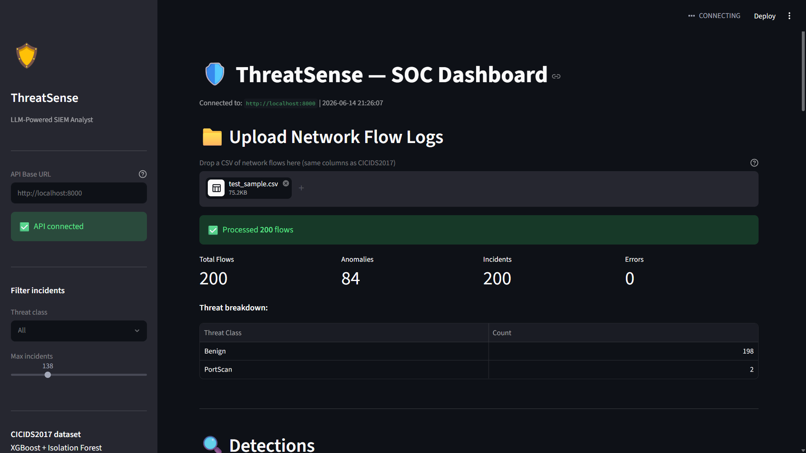
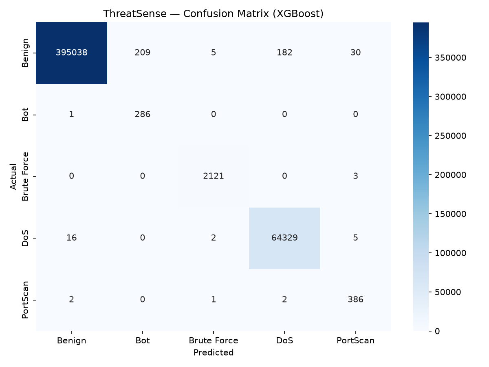
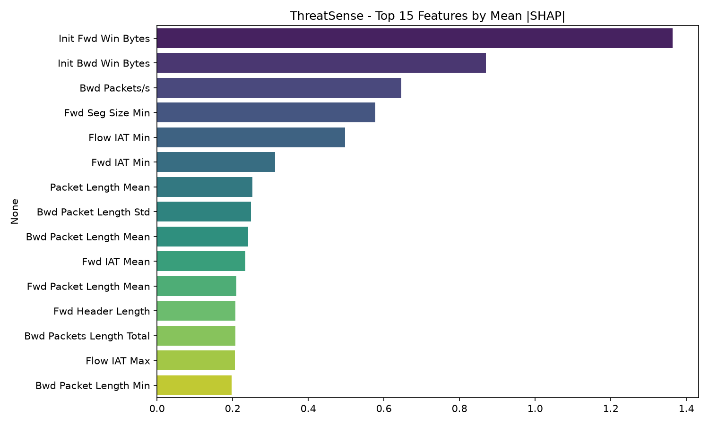

# ThreatSense — LLM-Powered Network Threat Detection

[](https://github.com/nadeemuddin138/threatsense/actions)
[](https://python.org)
[](LICENSE)

An end-to-end ML system that detects network threats in real time, maps them to MITRE ATT&CK techniques, and generates structured SOC incident reports using a LangGraph multi-agent pipeline.

Built on the CICIDS2017 dataset (2.3 million network flows) as a final-year B.E. portfolio project.

---

## What it does

1. **Ingests** raw network flow logs (CICIDS2017 format)
2. **Detects anomalies** using Isolation Forest
3. **Classifies threats** into 5 categories using XGBoost
4. **Maps** each threat to MITRE ATT&CK techniques
5. **Generates** a SOC incident report via a 3-node LangGraph agent (Groq Llama 3.1 70B)
6. **Serves** everything through a FastAPI backend and Streamlit dashboard

---

## Screenshots

### Dashboard


### Confusion Matrix


### SHAP Feature Importance


---

## Results

Trained on 1.85M flows, evaluated on 462K held-out flows:

| Class | Precision | Recall | F1 |
|---|---|---|---|
| Benign | 1.00 | 1.00 | 1.00 |
| DoS | 1.00 | 1.00 | 1.00 |
| Brute Force | 1.00 | 1.00 | 1.00 |
| PortScan | 0.91 | 0.99 | 0.95 |
| Bot | 0.58 | 1.00 | 0.73 |
| **Macro F1** | | | **0.9348** |

Bot precision is lower due to extreme class imbalance (1,035 Bot samples vs 1.4M Benign). Class weights ensure 100% Bot recall — in a SOC context, missing an attack is worse than a false positive.

---

## Project structure

```
threatsense/
├── src/
│   ├── preprocess.py      # CICIDS2017 cleaning and feature engineering
│   ├── train.py           # Model training (Isolation Forest + XGBoost + SHAP)
│   ├── inference.py       # Prediction pipeline
│   ├── mitre_mapper.py    # MITRE ATT&CK technique mapping
│   └── agent.py           # LangGraph SOC report agent
├── api/
│   └── main.py            # FastAPI backend (6 routes, SQLite)
├── frontend/
│   └── app.py             # Streamlit dashboard
├── tests/                 # 70 pytest tests
├── docs/                  # Screenshots, confusion matrix, SHAP plots
└── docker/                # Dockerfiles
```

---

## Tech stack

| Component | Technology |
|---|---|
| Dataset | CICIDS2017 (2.3M network flows) |
| Anomaly detection | Isolation Forest (scikit-learn) |
| Threat classification | XGBoost |
| Explainability | SHAP |
| LLM agent | LangGraph + Groq (Llama 3.1 70B) |
| Backend | FastAPI + SQLite |
| Frontend | Streamlit |
| Testing | pytest (70 tests) |
| CI | GitHub Actions |

---

## Setup

**Requirements:** Python 3.12+, a free [Groq API key](https://console.groq.com)

```bash
git clone https://github.com/nadeemuddin138/threatsense.git
cd threatsense

python -m venv .venv
source .venv/bin/activate        # Windows: .venv\Scripts\Activate.ps1
pip install -r requirements.txt

cp .env.example .env
# Add your GROQ_API_KEY to .env
```

**Get the dataset:**
Download the CICIDS2017 Parquet files from [Kaggle](https://www.kaggle.com/datasets/dhoogla/cicids2017) and place them in `data/raw/`.

**Preprocess and train:**
```bash
python -m src.preprocess --raw-dir data/raw --out-dir data/processed --artifacts-dir models
python -m src.train --sample 100000   # quick run; remove --sample for full training
```

**Run:**
```bash
# Terminal 1 — API
python -m uvicorn api.main:app --reload --port 8000

# Terminal 2 — Dashboard
streamlit run frontend/app.py
```

- API docs: http://localhost:8000/docs
- Dashboard: http://localhost:8501

---

## API

| Method | Endpoint | Description |
|---|---|---|
| GET | `/health` | Health check |
| POST | `/predict` | Single flow prediction |
| POST | `/analyze` | Batch CSV upload |
| POST | `/report/{id}` | Generate SOC incident report |
| GET | `/incidents` | List stored incidents |
| GET | `/incidents/{id}` | Get one incident |

---

## MITRE ATT&CK mapping

| Threat | Technique | Tactic | Severity |
|---|---|---|---|
| DoS | T1498, T1499 | Impact | Critical |
| Bot | T1071, T1059 | Command & Control | Critical |
| Brute Force | T1110, T1110.001 | Credential Access | High |
| PortScan | T1046 | Discovery | Medium |

---

## Tests

```bash
pytest tests/ -v   # 71 tests
```

---

## About

Built by **Mohammed Nadeem Uddin** — Final-year B.E., AI & Data Science, CBIT Hyderabad.

- GitHub: [nadeemuddin138](https://github.com/nadeemuddin138)
- LinkedIn: [Mohammed Nadeem Uddin](https://www.linkedin.com/in/nadeem-uddin-028996272/)
